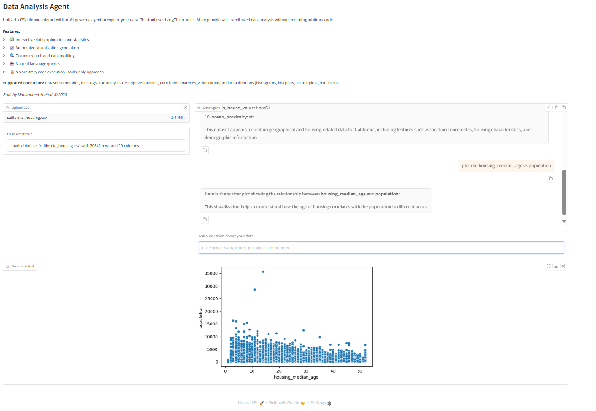

# Data Analysis Agent 🤖📊

An intelligent, conversational data analysis assistant powered by AI. Upload CSV files and explore your data through natural language queries - no coding required!

[](https://www.python.org/downloads/)
[](https://langchain.com/)
[](https://gradio.app/)
[](https://opensource.org/licenses/MIT)

<div align="center">
  
</div>

## ✨ Features

- 🗣️ **Natural Language Queries** - Ask questions about your data in plain English
- 📊 **Automated Visualizations** - Generate histograms, scatter plots, box plots, and bar charts instantly
- 🔍 **Smart Data Exploration** - Find columns, check missing values, compute statistics
- 📈 **Statistical Analysis** - Descriptive stats, correlations, value distributions
- 🔒 **Safe & Sandboxed** - No arbitrary code execution - uses predefined tools only
- 💬 **Conversational Interface** - Chat-based interaction with memory of context
- 🐳 **Docker Ready** - One-command deployment with Docker Compose

## 🎯 Use Cases

- **Data Scientists** - Quick EDA without writing code
- **Business Analysts** - Self-service data exploration
- **Students** - Learn data analysis through conversation
- **Researchers** - Rapid dataset profiling and visualization

## 🚀 Quick Start

### Option 1: Docker (Recommended)
```bash
# Clone the repository
git clone https://github.com/M12Shehab/DataAnalysisAgent.git
cd data-analysis-agent

# Create .env file with your API key
echo "OPENAI_API_KEY=your_api_key_here" > .env

# Launch with Docker Compose
docker-compose up --build
```

Visit `http://localhost:7860` 🎉

### Option 2: Local Installation

**Prerequisites:**
- Python 3.11 or higher
- pip package manager

**Steps:**
```bash
# Clone the repository
git clone https://github.com/M12Shehab/DataAnalysisAgent.git
cd data-analysis-agent

# Create virtual environment
python -m venv venv
source venv/bin/activate  # On Windows: venv\Scripts\activate

# Install dependencies
pip install -r requirements.txt

# Create .env file
cp .env.example .env
# Edit .env and add your API key

# Run the application
python -m app.main
```

Open your browser to `http://localhost:7860`

## 🔧 Configuration

Create a `.env` file in the project root:
```env
# Required: Your OpenAI or OpenRouter API key
OPENAI_API_KEY=sk-your-api-key-here

# Optional: Use OpenRouter for more model choices
OPENAI_BASE_URL=https://openrouter.ai/api/v1
OPENROUTER_MODEL=openai/gpt-4o-mini

# Application Settings
APP_TITLE=Data Analysis Agent
GRADIO_HOST=0.0.0.0
GRADIO_PORT=7860
GRADIO_SHARE=false
MAX_UPLOAD_SIZE_MB=50

# Branding (optional)
AUTHOR=Your Name
COPYRIGHT_YEAR=2026
```

### Supported LLM Providers

- **OpenAI** - Direct API access (gpt-4, gpt-4-turbo, gpt-3.5-turbo)
- **OpenRouter** - Access to 100+ models (Claude, Llama, Gemini, etc.)
- **Azure OpenAI** - Enterprise deployments

## 📖 Usage Guide

### Basic Workflow

1. **Upload Dataset**
```
   Click "Upload CSV" → Select your .csv file
```

2. **Ask Questions**
```
   "What columns do I have?"
   "Show me the first 10 rows"
   "What's the average income?"
   "Plot the distribution of house prices"
```

3. **View Results**
   - Text responses in chat
   - Visualizations in "Generated Plot" section

### Example Queries

**Data Exploration:**
- "Give me a summary of the dataset"
- "Show me 5 sample rows"
- "Which columns contain 'price'?"

**Statistics:**
- "Show me missing values"
- "Describe the numeric columns"
- "What are the most common values in the category column?"
- "Calculate correlations between all numeric columns"

**Visualizations:**
- "Plot a histogram of age"
- "Create a scatter plot of height vs weight"
- "Show me a box plot of salary"
- "Make a bar chart of product categories"

## 🛠️ Available Tools

The agent uses **8 predefined tools** for safe data analysis:

| Tool | Description | Example Usage |
|------|-------------|---------------|
| `dataset_summary` | Overview of shape, columns, types | First tool called automatically |
| `sample_rows` | View first N rows (max 20) | "Show me 10 rows" |
| `find_columns` | Search columns by keyword | "Find columns with 'date'" |
| `describe_columns` | Statistical summaries | "Describe numeric columns" |
| `missing_values` | Count NaN/missing values | "Check for missing data" |
| `value_counts` | Frequency of unique values | "Count categories" |
| `correlation_matrix` | Compute correlations | "Show correlations" |
| `plot` | Create visualizations | "Plot histogram of price" |

### Visualization Types

- **Histogram** (`hist`) - Distribution of single numeric column
- **Box Plot** (`box`) - Outliers and quartiles
- **Scatter Plot** (`scatter`) - Relationship between two numeric columns
- **Bar Chart** (`bar`) - Categorical value counts (top 10)

## 🏗️ Architecture

### Design Principles

1. **Safety First** - No arbitrary code execution
2. **Tools-Only** - All operations through validated functions
3. **Stateful** - Dataset persists in memory during session
4. **Conversational** - LLM orchestrates multi-step analysis

### System Flow
```
User Query → LangChain Agent → Tool Selection → Tool Execution → Response
                    ↑                                    ↓
                    └──────── Iterative Reasoning ──────┘
```

### Project Structure
```
data-analysis-agent/
├── app/
│   ├── __init__.py
│   ├── main.py              # Gradio UI and event handlers
│   ├── agent.py             # LangChain agent configuration
│   ├── config.py            # Environment-based settings
│   ├── state.py             # Global app state (DataFrame storage)
│   └── tools/
│       ├── __init__.py
│       ├── dataframe.py     # Dataset inspection tools
│       ├── stats.py         # Statistical analysis tools
│       └── visualization.py # Safe plotting tools
├── requirements.txt         # Python dependencies
├── Dockerfile              # Container image definition
├── docker-compose.yml      # Multi-container orchestration
├── .env.example           # Environment template
├── .gitignore
└── README.md
```

## 📦 Dependencies

**Core:**
- `langchain` - Agent framework
- `langchain-classic` - Legacy agent implementations
- `langchain-openai` - OpenAI integration
- `gradio` - Web UI framework

**Data & Viz:**
- `pandas` - Data manipulation
- `numpy` - Numerical computing
- `matplotlib` - Plotting backend
- `seaborn` - Statistical visualizations

**Utilities:**
- `python-dotenv` - Environment management
- `pytz` - Timezone handling

## 🔒 Security & Limitations

### Security Features

✅ No arbitrary code execution  
✅ Predefined tool set only  
✅ Input validation on all tools  
✅ File size limits (50MB default)  
✅ Sandboxed Docker deployment  

### Current Limitations

- **File Size:** 50MB maximum (configurable)
- **Plot Types:** 4 types (hist, box, scatter, bar)
- **Sample Rows:** 20 row maximum
- **Bar Charts:** Top 10 categories only
- **Iterations:** 10 tool calls per query max
- **File Format:** CSV only

### Planned Features

- [ ] Support for Excel (.xlsx) files
- [ ] More visualization types (heatmaps, pair plots)
- [ ] Data export functionality
- [ ] Multi-file comparison
- [ ] Custom tool creation interface
- [ ] Persistent conversation history

## 🧪 Development

### Running Tests
```bash
pytest tests/
```

### Code Quality
```bash
# Format code
black app/

# Lint
flake8 app/

# Type checking
mypy app/
```

### Environment Setup for Development
```bash
# Install dev dependencies
pip install -r requirements-dev.txt

# Pre-commit hooks
pre-commit install
```

## 🤝 Contributing

Contributions are welcome! Here's how you can help:

1. **Fork the repository**
2. **Create a feature branch**
```bash
   git checkout -b feature/AmazingFeature
```
3. **Commit your changes**
```bash
   git commit -m 'Add some AmazingFeature'
```
4. **Push to the branch**
```bash
   git push origin feature/AmazingFeature
```
5. **Open a Pull Request**

### Contribution Ideas

- Add new visualization types
- Support additional file formats
- Improve error handling
- Add unit tests
- Enhance documentation
- Optimize performance

## 📝 License

This project is licensed under the MIT License - see the [LICENSE](LICENSE) file for details.

## 👤 Author

**Mohammed Shehab**

- 🎓 PhD in Software Engineering
- 👨‍🏫 AI/ML Instructor at Concordia University
- 🔬 10+ years in AI/ML research and development
- 📚 15+ publications in top-tier conferences

**Connect:**
- 💼 [LinkedIn](https://linkedin.com/in/mohammed-shehab)
- 🐙 [GitHub](https://github.com/M12Shehab)

## 🙏 Acknowledgments

- [LangChain](https://github.com/langchain-ai/langchain) - Powerful agent framework
- [Gradio](https://gradio.app/) - Intuitive UI library
- [OpenAI](https://openai.com/) - GPT models
- [OpenRouter](https://openrouter.ai/) - Multi-model API gateway

## 📊 Project Stats

- **Language:** Python 3.11+
- **Framework:** LangChain + Gradio
- **License:** MIT
- **Status:** Active Development

## 💬 Support

- **Issues:** [GitHub Issues](https://github.com/M12Shehab/DataAnalysisAgent/issues)
- **Discussions:** [GitHub Discussions](https://github.com/M12Shehab/DataAnalysisAgent/discussions)
- **Email:** shihab@live.cn

---

<div align="center">

**⭐ If you find this project useful, please consider giving it a star! ⭐**

Made by [Mohammed Shehab](https://github.com/yourusername)

© 2026 Mohammed Shehab | MIT License

</div>